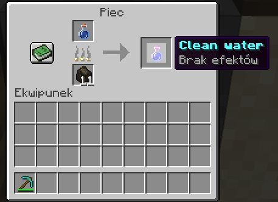
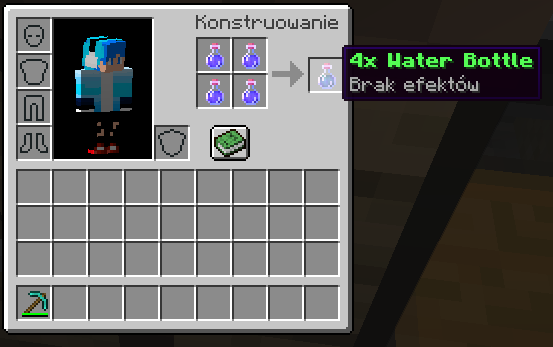

# Hydration Plugin

The Hydration Plugin is a Minecraft plugin that introduces a thirst mechanic to your server running Minecraft 1.16.5. Players will have a hydration level that affects their gameplay and requires them to drink water to stay hydrated.

## Features

- Thirst mechanic: Players will have a thirst level that gradually decreases over time.
- Hydration bar: A boss bar is displayed to players, indicating their current hydration level.
- Drinking water: Players can consume water to replenish their hydration level.
- Different water types: The plugin supports clean water, dirty water, and special potions with hydration effects.
- Customizable settings: You can configure the maximum hydration level, water effects, and more.

## Installation

1. Download the Hydration Plugin JAR file from the [releases](https://github.com/your-username/hydration-plugin/releases) page.
2. Place the JAR file in the `plugins` folder of your Minecraft server.
3. Restart the server to load the plugin.

## Usage

- Players will start with a default hydration level.
- The boss bar will be displayed on the screen, indicating the current hydration level.
- To drink water, players can consume water bottles or special potions.
- Drinking clean water will increase the hydration level.
- Drinking dirty water may have negative effects on the player.
- Players should keep an eye on their hydration level to avoid negative consequences.

## Recipes

### Clean Water Recipe

To craft clean water, you need to smelt a Dirty water like this:

### 4x Clean Water Recipe

To craft 4x clean water, you need the follow this:

## Configuration

You can customize the plugin settings by modifying the `config.yml` file located in the plugin folder. Here are some configurable options:

- `maximum_hydration_level`: The maximum hydration level a player can have.
- `clean_water_level`: The amount of hydration level gained from drinking clean water.
- `dirty_water_level`: The amount of hydration level gained from drinking dirty water.

## Contact

If you have any questions or need support, you can reach out to the plugin author at Discord [Server](https://discord.com).

